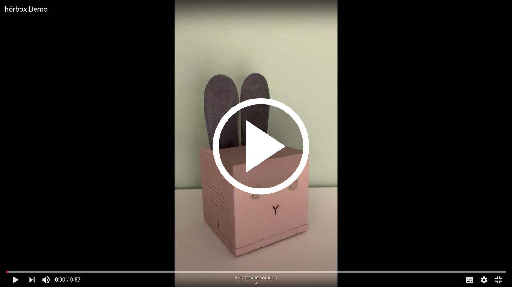

# hörbox

DIY MP3 player for kids.

[](https://youtu.be/Yf6WE-lvUVw)

## Features

* Press "eye" button: Increase/decrease volume
* Press and hole "eye": rewind / fast forward (the longer you hole, the more you rewind / fast forward)
* Press both "eyes": Start MP3 from beginning
* If no MP3 is found for RFID Tag, a empty file is added to the SD card to help you with the naming.
* If you forget to turn off, a sound will appear from time to time.

## Hints

I process all my MP3 with https://auphonic.com/ to ensure a consistent noice level.

## Hardware

### Parts list

| Part                                             | ~Price | Sample Supplier |
| ------------------------------------------------ | ------ | --------------- |
| 1 x ESP32 LyraT V4.3                             | 18,00€ | [mouser](https://www.mouser.de/ProductDetail/356-ESP32-LYRAT) |
| 1 x LiPo Akku 3,7V 2500mAh (JST-PHR-2 Connector) |  8,94€ | [Eckstein](https://eckstein-shop.de/LiPoAkkuLithium-IonPolymerBatterie32C7V2500mAhJST-PHConnector) |
| 1 x JST-PH 2,0mm (20 Paare) 2 Pin                |  4,19€ | [Eckstein](https://eckstein-shop.de/JST-PH22C0mmStecker26DrahtmitJST-PHBuchseKit20Paare2Pin) |
| 2 x Lautsprecher 4 Ohms, 3 W                     |  8,14€ | [mouser](https://www.mouser.de/ProductDetail/665-AS07104PO-R) |
| 1 x MicroSD Card 16 GB                           | 12,19€ | [mouser](https://www.mouser.de/ProductDetail/467-SDSDQAB-016G-J) |
| 2 x Pushbutton switch Off (On)                   | 11,60€ | [mouser](https://www.mouser.de/ProductDetail/612-PV2F240NN) |
| 1 x male-female jumper wires (10 pieces)         |  4,43€ | [mouser](https://mou.sr/3SfRufG) |
| 1 x On/Off switch                                |        | | 
| 1 x Fuse                                         |        | |
| 1 x Fuse holder                                  |        | |
| 1 x RFID/NFC reader RC522 I2C v1.1               |  6,08€ | [AliExpress](https://de.aliexpress.com/item/32790073855.html) |
| 1 x RFID/NFC Tags (10 pieces)                    |  4,95€ | [ebay](https://www.ebay.de/itm/10-Stuck-NFC-Tags-Sticker-13-56MHz-Ntag213-rund-25mm-ISO14443A-NTAG-213/123385943615?hash=item1cba60163f:g:PHIAAOSwxORdrI~e) |

You likely find better prices. I tried to keep the number of suppliers low.

TODO add fuse details

### Wiring

> **WARNING**
> The polarity of the battery connector does not match the polarity on the board! I had to pull out the socket on the board and turn it 180°.

#### RFID reader


#### RFID reader to board


#### Pushbutton switches (eyes) to board


#### Battery to board

I'm not sure if the fuse is needed and properly sized. It feels better to have one :)

TODO add pictures

### Wooden box

Wood thickness: 10mm

* A: 116mm x 116mm
* B: 116mm x 116mm
* C: 116mm x 96mm
* D: 96mm x 96mm
* E: 116m x 96mm
* F: 96m x 96mm


TODO add pictures

* [Side C](./doc/box-c.pdf)
* [Side D](./doc/box-d.pdf)
* [Side E](./doc/box-e.pdf)
* [Side F](./doc/box-f.pdf)

## Software 

### Docs

* https://docs.espressif.com/projects/esp-adf/en/latest/get-started/get-started-esp32-lyrat.html
* https://docs.espressif.com/projects/esp-adf/en/latest/design-guide/board-esp32-lyrat-v4.3.html


### Setup env

> Requires Python 2.7 (we use https://github.com/pyenv/pyenv)
> Requires [ESP ADF v2.0](https://docs.espressif.com/projects/esp-adf/en/v2.0/get-started/index.html)

```
/bin/bash
export ADF_PATH=$HOME/esp/esp-adf
. $HOME/esp/esp-adf/esp-idf/export.sh
```

### Build / Flash

Press and hold <Boot> button, press <Reset> button and release <Boot> button.

```
make flash monitor -j5
```

### ESP ADF version used

Inside `~/esp/esp-adf`:

```bash
git fetch
git checkout v2.0
git submodule update --init --recursive
```
