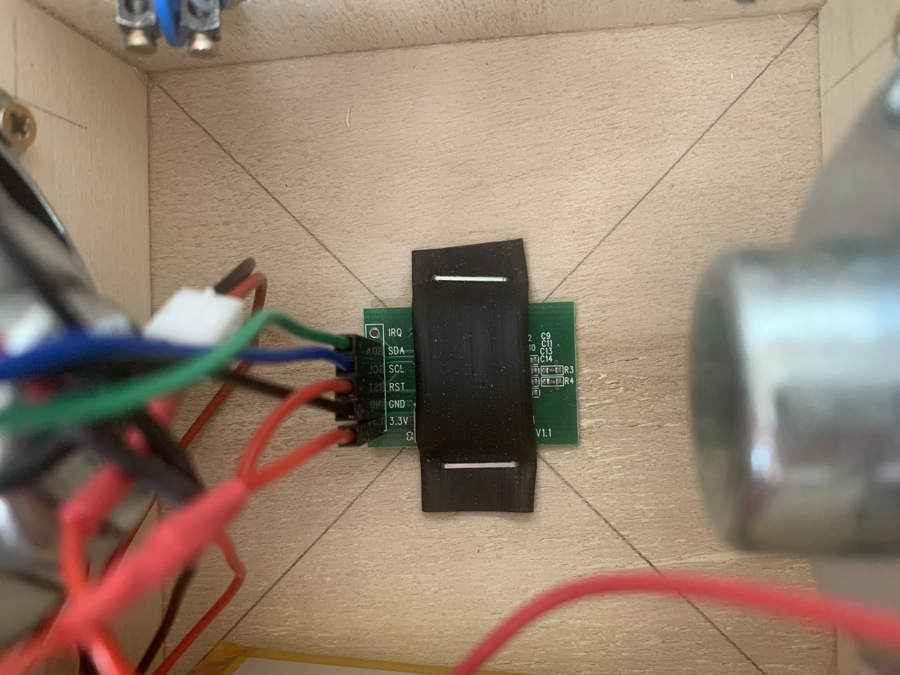
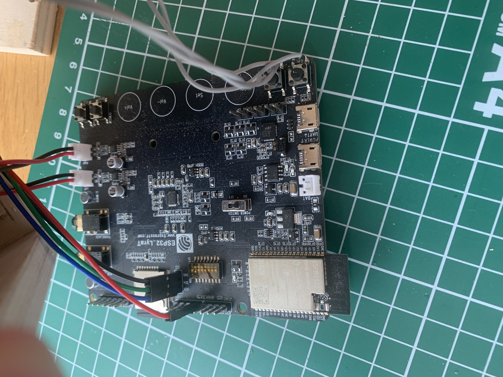
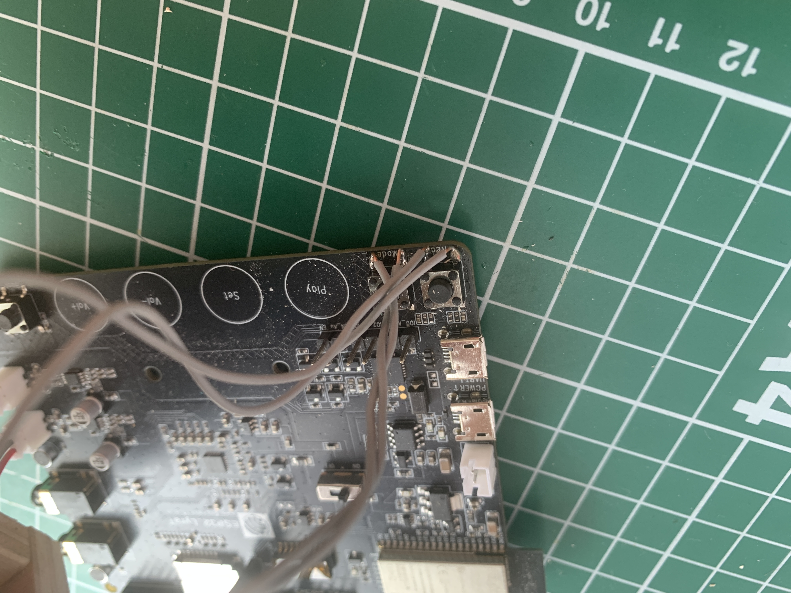
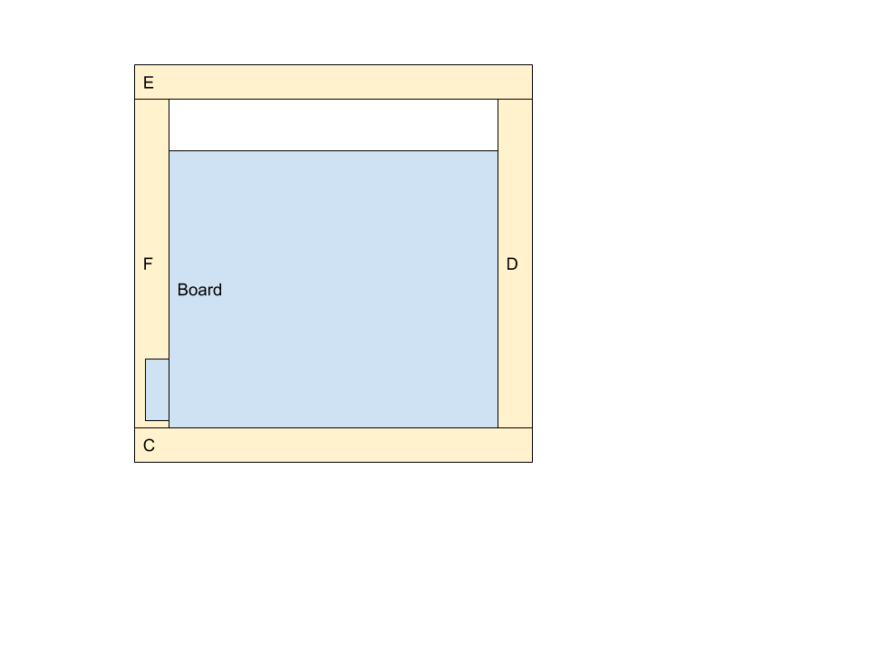
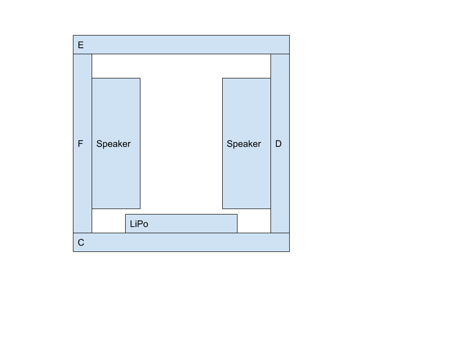

# hörbox

DIY MP3 player for kids.

<iframe width="560" height="315" src="https://www.youtube.com/embed/Yf6WE-lvUVw" frameborder="0" allow="accelerometer; autoplay; clipboard-write; encrypted-media; gyroscope; picture-in-picture" allowfullscreen></iframe>

## Features

* Press "eye" button: Increase/decrease volume
* Press and hole "eye": rewind / fast forward (the longer you hole, the more you rewind / fast forward)
* Press both "eyes": Start MP3 from beginning
* If no MP3 is found for RFID Tag, a empty file is added to the SD card to help you with the naming.
* If you forget to turn off, a sound will appear from time to time.

## Hints

I process all my MP3 with https://auphonic.com/ to ensure a consistent noice level.

## Hardware

### Parts list

| Part                              | ~Price | Sample Supplier |
| --------------------------------- | ------ | --------------- |
| 1 x ESP32 LyraT V4.3              | 18€    | [mouser](https://www.mouser.de/ProductDetail/Espressif-Systems/ESP32-LyraT?qs=MLItCLRbWsxPzPCja546ZA%3D%3D) |
| 1 x Li Ion 3,7V Single Cell       | 8,94€  | [Eckstein](https://eckstein-shop.de/LiPo-Akku-Lithium-Ion-Polymer-Batterie-37V-2500mAh-JST-PH-Connector) |
| 2 x JST-PH 2,0mm Stecker (+Kabel) | 6,13€  | [Eckstein](https://eckstein-shop.de/JST-PH-20mm-Stecker-Draht-mit-JST-PH-Buchse-Kit-20-Paare-2-Pin) |
| 2 x Lautsprecher 4 Ohms, 3 W      | 3,81€  | [mouser](https://www.mouser.de/ProductDetail/PUI-Audio/AS07104PO-R?qs=sGAEpiMZZMuTkJYgZlQcSbW9ML0uaZ6LpGpDDijgikQ%3D) |
| 1 x MicroSD Card 16 GB            | 9,25€  | [mouser](https://www.mouser.de/ProductDetail/SanDisk/SDSDQAB-016G?qs=sGAEpiMZZMtyMAXUUxCBE9Ul6KnuQP9qFKjsXIXONRD3eiWF76rYPA%3D%3D) |
| 1 x RFID/NFC reader RC522 (I2C)   | 2,55€  | [ebay](https://www.ebay.de/itm/13-56MHz-I2C-SPI-Interface-IC-RC522-RFID-Read-Write-Card-Module-IC-Keychain/153189301847) |
| 10 x RFID/NFC Tags                | 4,95€  | [ebay](https://www.ebay.de/itm/10-Stuck-NFC-Tags-Sticker-13-56MHz-Ntag213-rund-25mm-ISO14443A-NTAG-213/123385943615?hash=item1cba60163f:g:PHIAAOSwxORdrI~e) |
| 1 x male-female jumper wires      | 4,43€  | [mouser](https://www.mouser.de/ProductDetail/BusBoard-Prototype-Systems/ZW-MF-10?qs=sGAEpiMZZMvh1pRuiUVjFQYodzHG%2F8cVnmC7Fx2tpUfKBfCMTbIqCA%3D%3D) |

> You will find all parts for better prices if you order them directly from China. 

### Wiring







### Wooden box






* [Side C](./doc/box-c.pdf)
* [Side D](./doc/box-d.pdf)
* [Side E](./doc/box-e.pdf)
* [Side F](./doc/box-f.pdf)

## Software 

### Setup env

> Requires [ESP ADF v2.0](https://docs.espressif.com/projects/esp-adf/en/v2.0/get-started/index.html)

```
/bin/bash
export ADF_PATH=$HOME/esp/esp-adf
. $HOME/esp/esp-adf/esp-idf/export.sh
```

### Build / Flash

Press and hold <Boot> button, press <Reset> button and release <Boot> button.

```
make flash monitor -j5
```

### ESP ADF version used

Inside `~/esp/esp-adf`:

```bash
git fetch
git checkout v2.0
git submodule update --init --recursive
```
